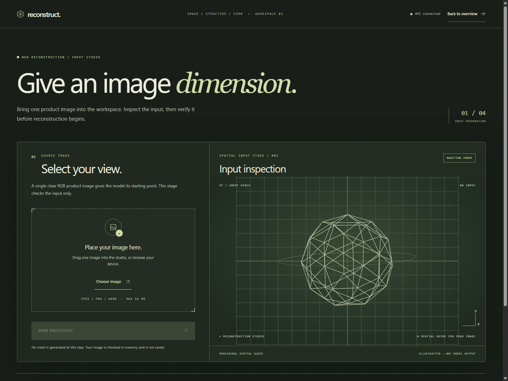
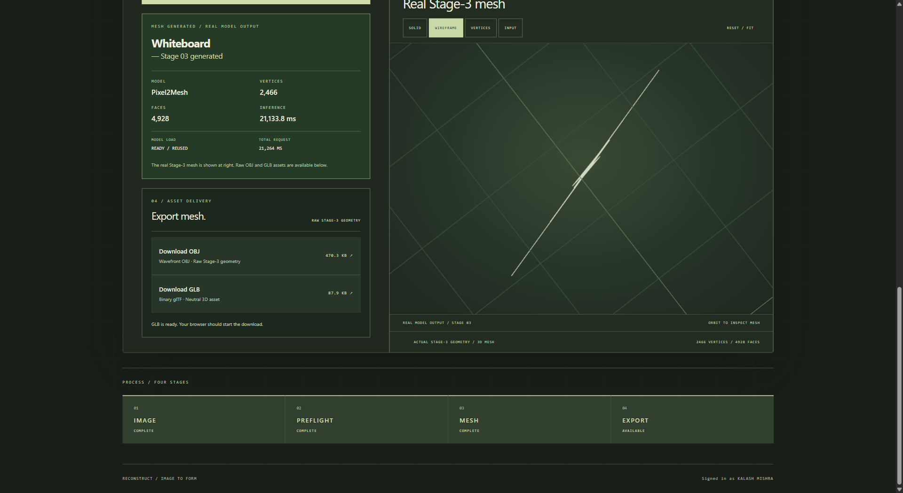

# 3D Object Reconstruction from Images

A single-image 3D reconstruction project built around a trained Pixel2Mesh model and an authenticated web workspace.

## Current flow

`Email / Google sign-in → protected dashboard → image validation → authenticated preflight → Pixel2Mesh inference → real Stage-3 geometry → interactive 3D viewer → OBJ / GLB download`

The workspace accepts one JPEG, PNG, or WebP image (up to 10 MB). Users can name the object while keeping the source filename visible; generic filenames are not treated as object labels. After preflight, a persistent CPU worker runs the trained model and returns the final mesh. The Three.js viewer supports **Solid**, **Wireframe**, **Vertices**, and **Input** comparison, with orbit, zoom, and Reset / Fit controls. Users can download the raw Stage-3 mesh as Wavefront OBJ or binary glTF (GLB) using a safe object-based filename. Downloads reuse the inference result; viewer transforms do not alter export coordinates. The GLB has a neutral material, not a fabricated photo texture.

## Preview

| Landing | Authentication |
| --- | --- |
|  |  |

| Dashboard | New Reconstruction |
| --- | --- |
|  |  |

**Real Stage-3 result viewer and export**



## Stack and layout

| Area | Technology |
| --- | --- |
| Model | Python, PyTorch, Pixel2Mesh |
| Backend | FastAPI, Supabase JWT verification, Pillow image checks |
| Frontend | React, JavaScript/JSX, Vite, Tailwind CSS, Axios, three.js with React Three Fiber/Drei |
| Authentication | Supabase Auth: email/password and Google OAuth |
| Planned persistence | Supabase PostgreSQL |

`backend/` contains the API and tests, `frontend/` the web app, `Pixel2Mesh/` the protected trained model, and `dataset_tools/` research utilities.

## Run locally

From the repository root in PowerShell, use the existing `.venv-p2m` ML environment and a local copy of the trained checkpoint:

```powershell
python -m venv backend/.venv
backend/.venv/Scripts/python.exe -m pip install -e "./backend[dev]"
$env:SUPABASE_URL = "<your Supabase project URL>"
backend/.venv/Scripts/python.exe -m uvicorn app.main:app --app-dir backend --reload
```

In another terminal, run `npm.cmd ci` and `npm.cmd run dev` from `frontend/`, then open `http://127.0.0.1:5173`. Set `VITE_SUPABASE_URL` and `VITE_SUPABASE_ANON_KEY` in ignored `frontend/.env.local`; use only a publishable key. See [frontend setup](frontend/README.md) for details. FastAPI starts without loading Torch; the `.venv-p2m` worker loads the checkpoint on first inference and reuses it afterward.

| Method | Endpoint | Purpose |
| --- | --- | --- |
| `GET` | `/api/v1/health` | Public API availability |
| `GET` | `/api/v1/me` | Identity from a verified Supabase token |
| `POST` | `/api/v1/reconstructions/preflight` | Authenticated image validation and metadata |
| `POST` | `/api/v1/reconstructions/infer` | Authenticated real Stage-3 mesh inference |

## Model baseline

Training is complete. The final checkpoint is local at `Pixel2Mesh/checkpoints/260000_000010.pt`, is Git-ignored, and must not be uploaded.

| Mesh stage | Vertices | Faces |
| --- | ---: | ---: |
| 1 | 156 | 308 |
| 2 | 618 | 1,232 |
| 3 (final) | 2,466 | 4,928 |

Test-set metrics: Chamfer Distance **0.037181**, F1 @ τ **0.000640**, and F1 @ 2τ **0.001722**. These are not accuracy percentages or quality scores for an uploaded image.

## Next

Reconstruction persistence/history, a Supabase storage strategy, and deployment remain to be built. Downloads are local to the current browser session; reconstructions are not yet saved.
