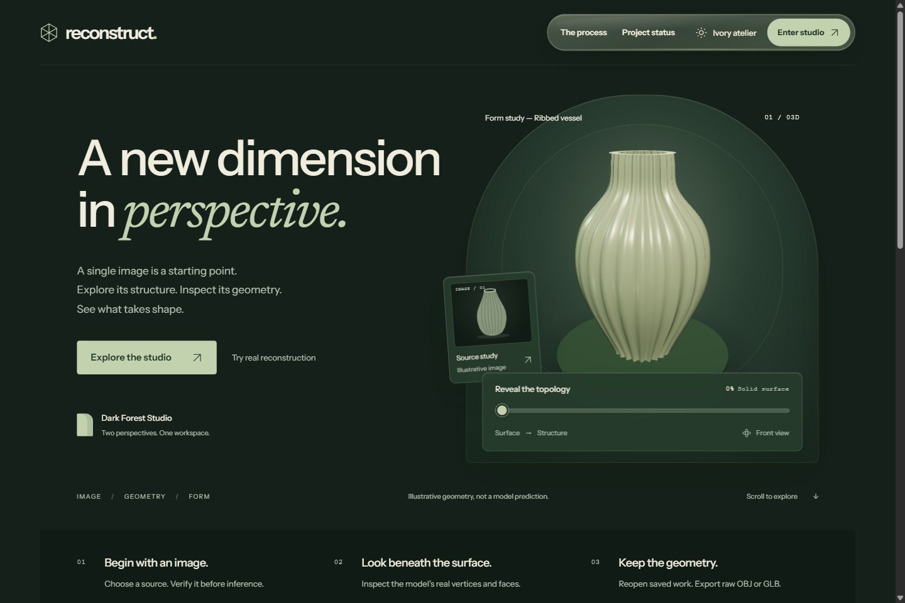
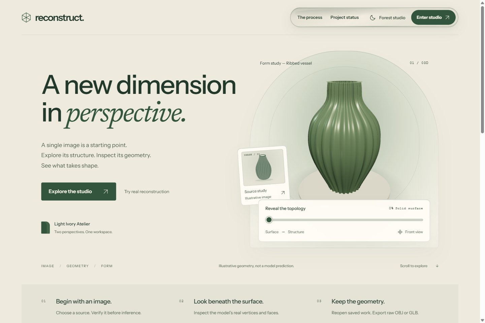
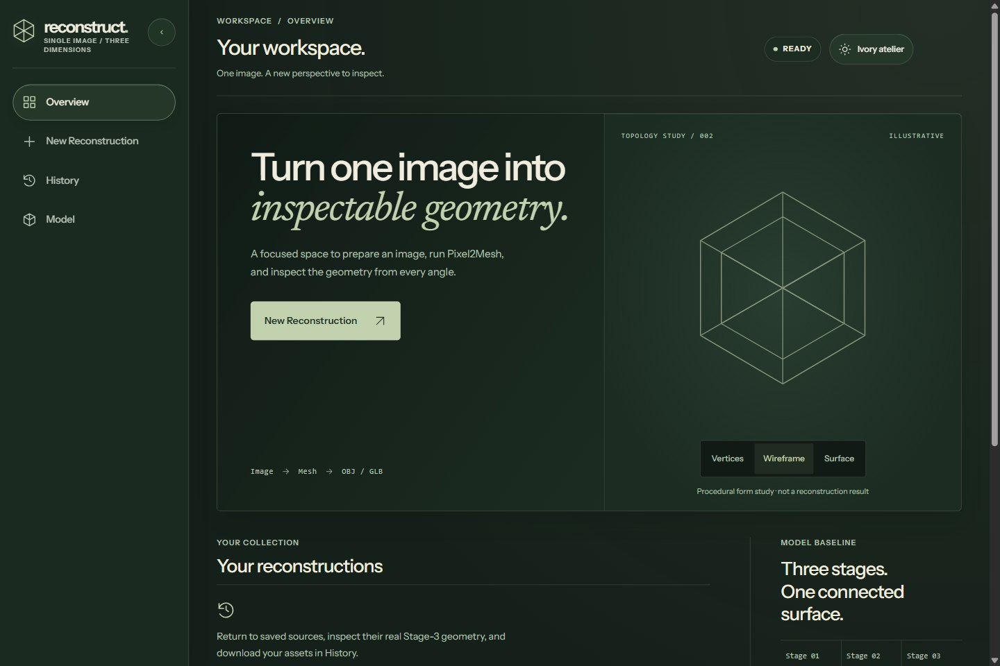
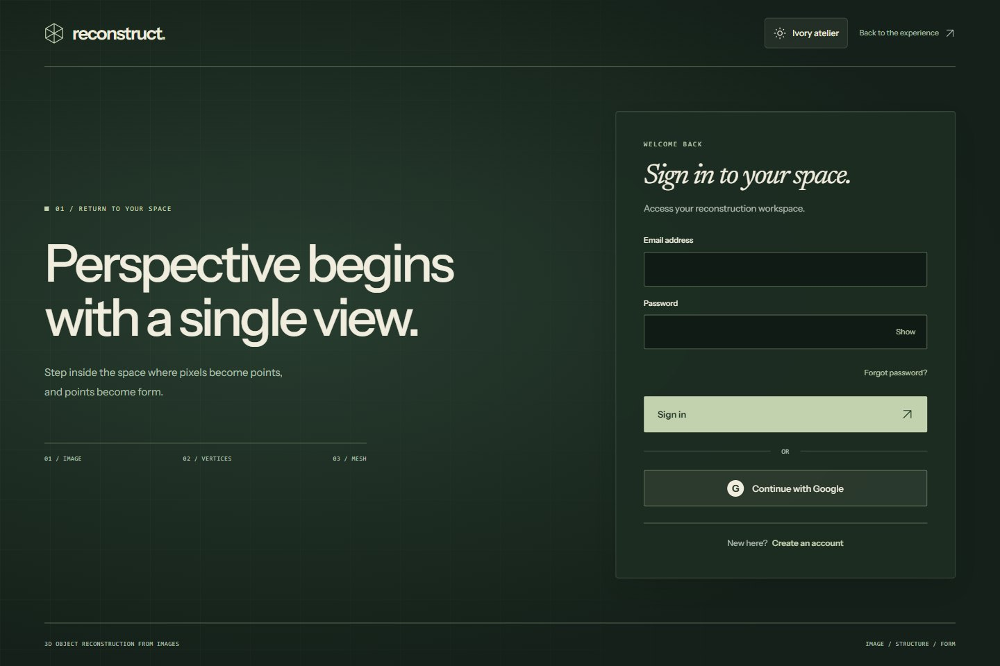
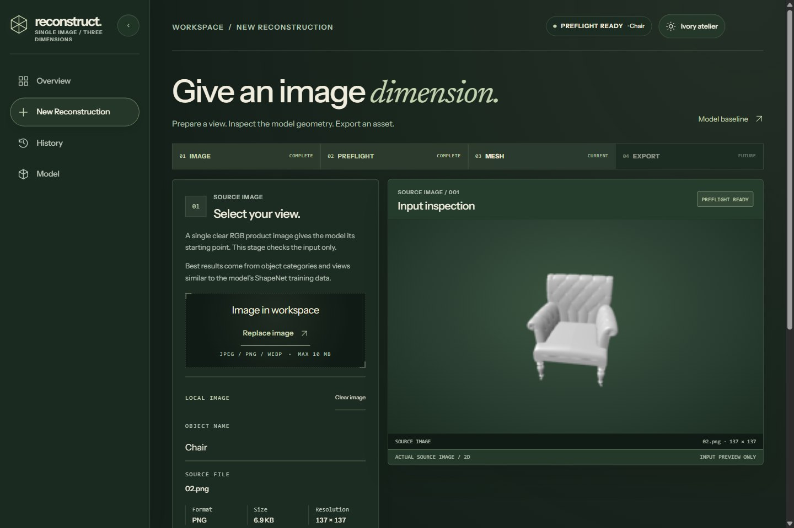
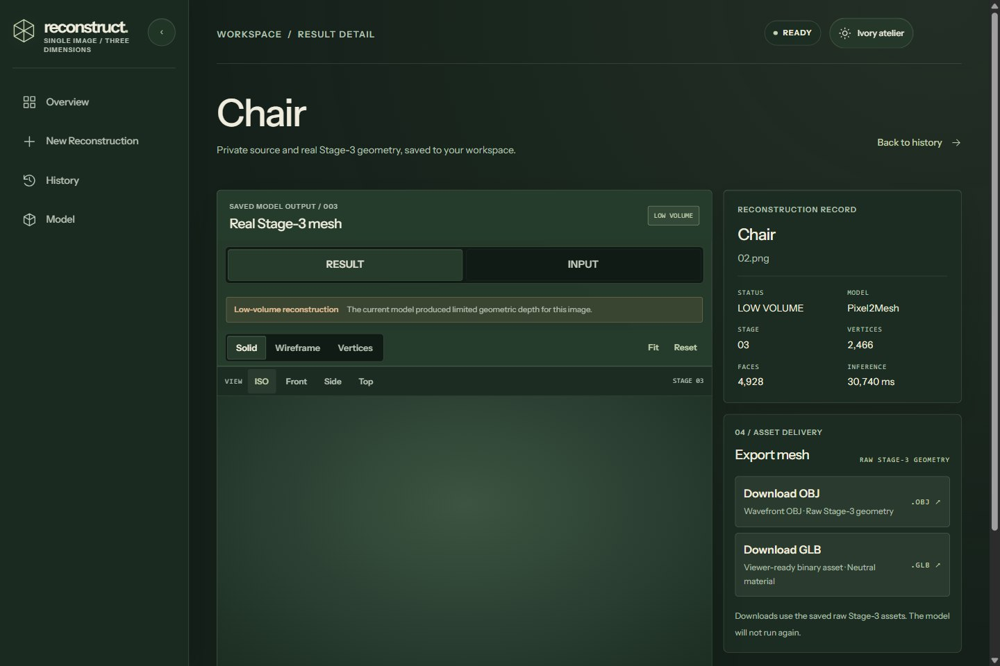
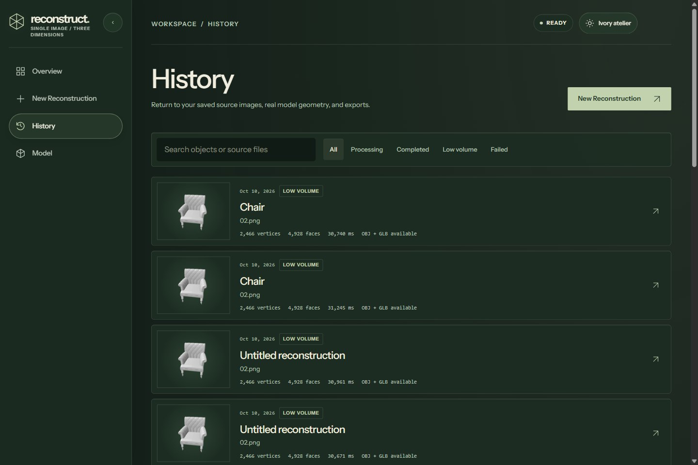
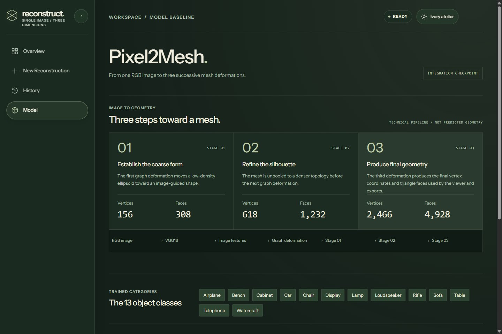

# Reconstruct

Reconstruct is a browser-based research workspace for inspecting how a single RGB image is processed into a 3D mesh. It connects the trained Pixel2Mesh model to an authenticated React and Three.js application, with persisted reconstruction records and raw OBJ/GLB exports.

The current checkpoint is an **integration baseline**. Some real predictions have very low geometric volume. The application shows and saves the model output as produced; reconstruction quality is still under review. The illustrative vessel on the public landing page is a design demo, not a prediction.

## Product

| Forest Studio | Ivory Atelier |
| --- | --- |
|  |  |

| Workspace overview | Sign in |
| --- | --- |
|  |  |

| New reconstruction · source inspection | Persisted Stage-3 result · low-volume output shown honestly |
| --- | --- |
|  |  |

| Saved history | Model explorer |
| --- | --- |
|  |  |

Screenshots show the real application. The landing vessel is explicitly illustrative; the Stage-3 result is real model output and may be low-volume.

## Architecture and capabilities

```text
React + Three.js workspace
  ├─ Supabase Auth (email/password and Google OAuth)
  ├─ Supabase PostgreSQL + private Storage (profiles and reconstruction artifacts)
  └─ FastAPI API → validated image → Pixel2Mesh worker → Stage-3 mesh
```

- The authenticated preflight checks actual JPEG, PNG, and WebP image content, dimensions, and size before inference.
- Pixel2Mesh runs in a persistent local worker environment behind FastAPI. The viewer supports Solid, Wireframe, Vertices, source-image inspection, orbit, camera presets, Fit, and Reset.
- History and Result Detail reopen user-owned records from Supabase. Private source images and mesh artifacts use authenticated Storage access; mesh coordinates are not stored in PostgreSQL.
- OBJ and GLB exports are generated from the same raw Stage-3 prediction. Display and camera transforms do not alter saved/exported coordinates, and exporting does not run inference again.
- The landing includes an interactive, topology-inspired vessel demonstration. It is illustrative and is never substituted for inference output.
- Forest and Ivory themes persist across public and authenticated pages. The workspace and viewer adapt to desktop and mobile layouts.
- Public-page metadata, Open Graph fields, SoftwareApplication structured data, and private-route `noindex` behavior provide an SEO foundation. A production domain has not been selected, so no canonical URL or sitemap is published.

## Model reference

Pixel2Mesh takes one RGB image, extracts image features with VGG16, then deforms a graph through three mesh stages.

| Stage | Vertices | Faces |
| --- | ---: | ---: |
| 1 | 156 | 308 |
| 2 | 618 | 1,232 |
| 3 | 2,466 | 4,928 |

Recorded test-set metrics are Chamfer Distance **0.037181**, F1 @ τ **0.000640**, and F1 @ 2τ **0.001722**. These aggregate measurements are not accuracy percentages and do not predict the quality of an individual image. The current integration checkpoint can produce collapsed or low-volume geometry. Future model-quality recovery and deployment are separate work; no quality improvement or deployed site is claimed here.

## Local development

Use the existing backend virtual environment, Pixel2Mesh worker environment, and local checkpoint. Keep local environment files out of Git. The API starter reads only the public `SUPABASE_URL` from ignored `backend/.env.local`; the frontend reads the Supabase project URL and publishable/anon key from ignored `frontend/.env.local`. Never put a service-role key in frontend configuration.

Start FastAPI from the `backend/` directory in one PowerShell terminal:

```powershell
Set-Location backend
.\.venv\Scripts\python.exe -m app.local_start
```

Start Vite in a second terminal:

```powershell
Set-Location frontend
npm.cmd ci
npm.cmd run dev
```

Open <http://127.0.0.1:5173>. For the first local setup, install backend dependencies from `backend/pyproject.toml` in `backend/.venv`, and configure the separate Pixel2Mesh worker environment as documented by the model setup. FastAPI health and authentication paths do not import Torch; the model worker starts on the first inference request and is reused afterward.

## API

| Method | Endpoint | Purpose |
| --- | --- | --- |
| `GET` | `/api/v1/health` | API process health; does not indicate model-worker readiness |
| `GET` | `/api/v1/me` | Current identity from a verified Supabase JWT |
| `POST` | `/api/v1/reconstructions/preflight` | Authenticated image decoding and validation |
| `POST` | `/api/v1/reconstructions/infer` | Authenticated Pixel2Mesh Stage-3 inference |

The frontend calls the API through the Vite `/api` proxy during local development. A production host will need an equivalent same-origin API route/proxy and SPA fallback, along with configured authentication redirect origins. Production deployment is not part of the current project state.
