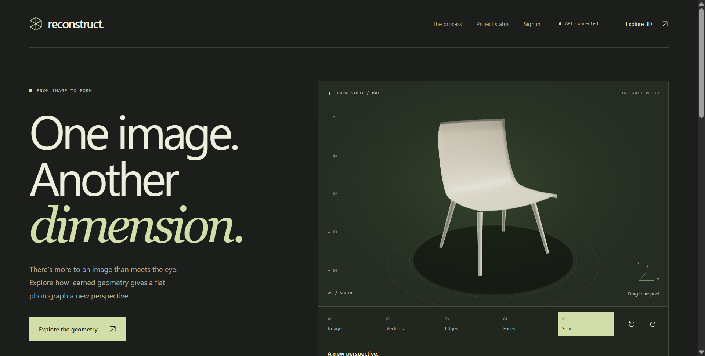
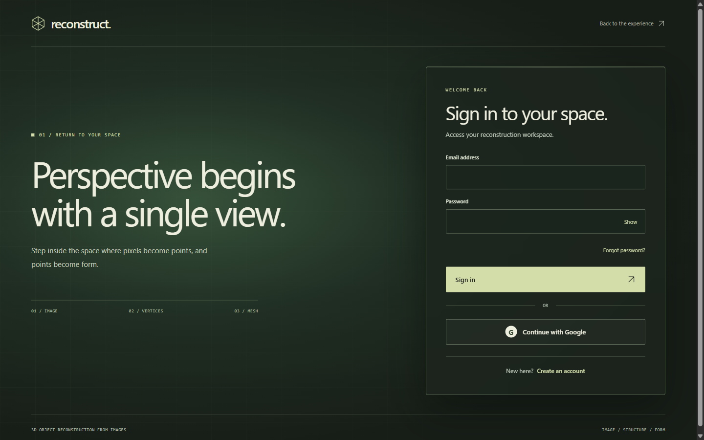
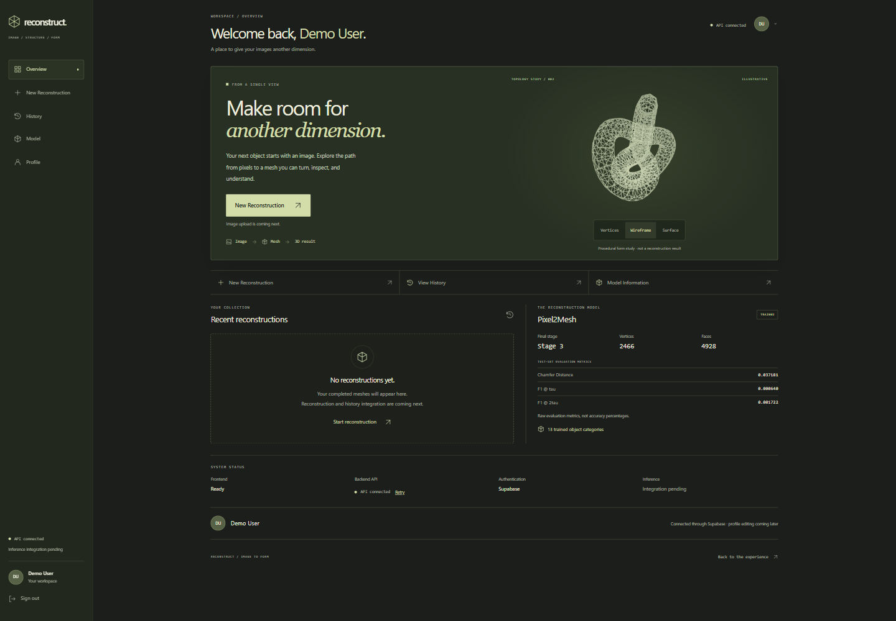

# 3D Object Reconstruction from Images

A college project that uses a trained Pixel2Mesh model to reconstruct a 3D mesh from one RGB image. The machine-learning work is complete; the web application is being built in small, testable stages.

## Intended pipeline

`RGB image -> Pixel2Mesh -> final Stage-3 mesh -> OBJ (and GLB when appropriate) -> FastAPI -> React 3D viewer`

Pixel2Mesh progressively deforms an ellipsoid into a mesh. The planned application will let a user upload an image, inspect and download the result, and view reconstruction history. This end-to-end application flow is not implemented yet.

## Current status

- **Working:** Trained Pixel2Mesh baseline, FastAPI health API, interactive React/Three.js landing page, Supabase email/password authentication, protected dashboard, and persistent browser sessions.
- **Pending:** Google OAuth provider configuration, backend JWT verification, image upload, Pixel2Mesh inference integration, interactive result viewer, and reconstruction history.

The health endpoint checks only that the API is serving requests. It does not load the model or confirm inference readiness.

## Preview

| Landing | Login | Dashboard |
| --- | --- | --- |
|  |  |  |

## Tech stack

| Area | Technology |
| --- | --- |
| Model | Python, PyTorch, Pixel2Mesh |
| API | FastAPI |
| Frontend | React, JavaScript/JSX, Tailwind CSS, Axios, three.js (with React Three Fiber / Drei) |
| Auth foundation / planned database | Supabase Auth and PostgreSQL |
| Mesh files | Stage-3 OBJ; GLB for browser viewing when appropriate |

## Repository structure

```text
backend/        FastAPI foundation and tests
Pixel2Mesh/     Trained model implementation and inference support
dataset_tools/  Dataset and research utilities
docs/           Project PRD and reference material
frontend/       React landing, authentication, dashboard, and tests
```

The repository root is the application root. Pixel2Mesh is one protected component within it.

## Backend quick start

From the repository root in PowerShell, with Python 3.11 or newer:

```powershell
python -m venv backend/.venv
backend/.venv/Scripts/python.exe -m pip install -e "./backend[dev]"
backend/.venv/Scripts/python.exe -m pytest -c backend/pyproject.toml backend/tests
backend/.venv/Scripts/python.exe -m uvicorn app.main:app --app-dir backend --reload
```

The server runs at `http://127.0.0.1:8000`. Use a separate backend environment; do not replace the existing Pixel2Mesh environment.

For frontend setup, see [frontend/README.md](frontend/README.md).

## Current API

| Method | Path | Response |
| --- | --- | --- |
| `GET` | `/api/v1/health` | `{"status":"ok","service":"3d-reconstruction-api"}` |

## ML and checkpoint

Training is complete. The final checkpoint is stored locally at `Pixel2Mesh/checkpoints/260000_000010.pt` and is intentionally Git-ignored. Do not upload it to the repository. The final reconstructed geometry is the Stage-3 mesh. The finalized V3 configuration and demo dataset support are in `Pixel2Mesh/`.

## Development roadmap

Configure Google OAuth and add backend token verification, then build validated upload, real inference, the result viewer, and history as connected feature slices.

## Limitations

Full local CPU end-to-end reconstruction has not been verified; the existing predictor rejects CPU inference. Results from a single image are inherently uncertain for hidden surfaces, and performance on real product photos may differ from the training data. No reconstruction accuracy value is claimed here.

See the [project PRD](docs/PRD/3D_Object_Reconstruction_PRD.pdf) for more context.
